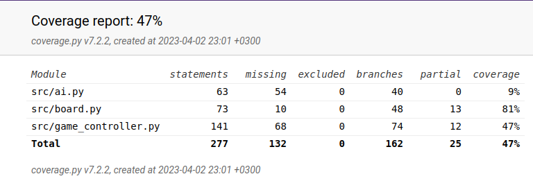

# Testausdokumentti

## Testauskattavuus
vanha kuva muokkaan ensi viikolla uudeksi

## Mitä ollaan testattu

GameBoard luokasta on ollaan testattu voittojen tarkistaminen. Syötteinä tähän käytettiin erilaisten neljän rivien tiputtamista pelilaudalle ja katsomalla
tunnistaako peli ne.
GameController luokasta ollaan testattu, pelinappien alustaminen ja pelinappulan pudottaminen pelissä.
Ai luokasta ollaan testattu minimax algoritmin toimivuutta, testaamalla löytääkö se nopeimman voiton tilanteesta, ja löytääkö se voiton yhdellä siirolla.
