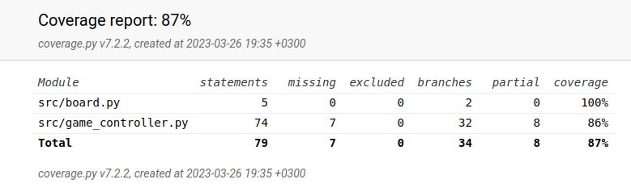
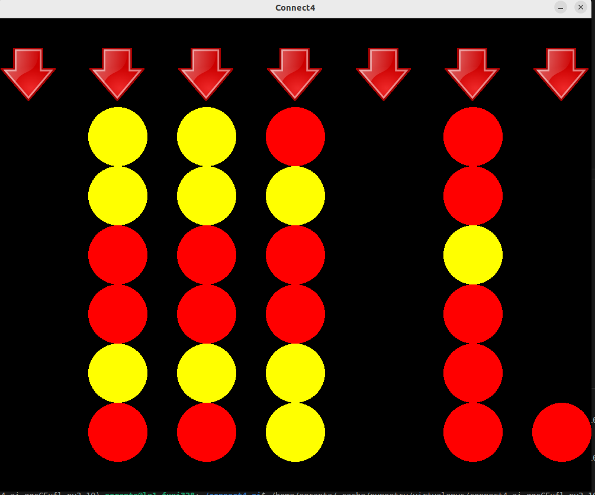

# Testausdokumentti

## Testauskattavuus



Testikattavuudesta on jätetty pois käyttöliittymän testaaminen, vaikka sitäkin ollaan kyllä testattu, ja EventQueue luokka.

## Mitä ollaan testattu

GameBoard luokasta on ollaan testattu voittojen tarkistaminen. Syötteinä tähän käytettiin erilaisten neljän rivien tiputtamista pelilaudalle ja katsomalla
tunnistaako peli ne. On myös testattu, että heuristiikka funktio toimii oikein Ai:n siirtoja varten.
GameController luokasta ollaan testattu, pelinappien alustaminen ja pelinappulan pudottaminen pelissä.
Ai luokasta ollaan testattu minimax algoritmin toimivuutta, testaamalla löytääkö se nopeimman voiton tilanteesta, ja löytääkö se voiton yhdellä siirolla.
Tässä tilanne, jossa Ai:n pitää löytää siirto 7 liikkeessä:

Eli Ai:n pitää laittaa viimeiselle sarakkeelle pallo, jotta se pakottaa lopulta pelaajan laittamaan ensimmäiselle tai viidennelle sarakkeelle pallon, joka johtaa Ai:n voittoon. On myös testattu, että Ai osaa estää pelaajan voiton, jonka pelaaja saisi muuten ensi vuorolla.

## Testien suorittaminen
Testit voidaan suorittaa poetryn avulla komennolla ```poetry run invoke test```. Testeistä saa luotua coverage kattavuuden komennolla ```poetry run invoke coverage``` ja kattavuusraportin komennolla ```poetry run invoke coverage_report```.
